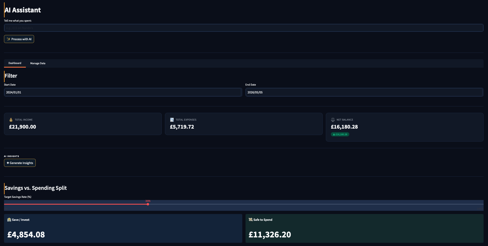
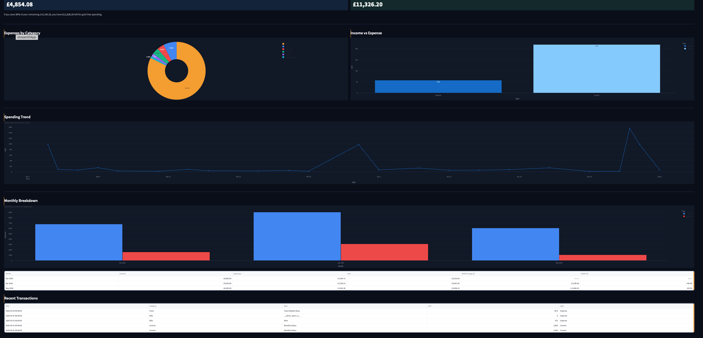
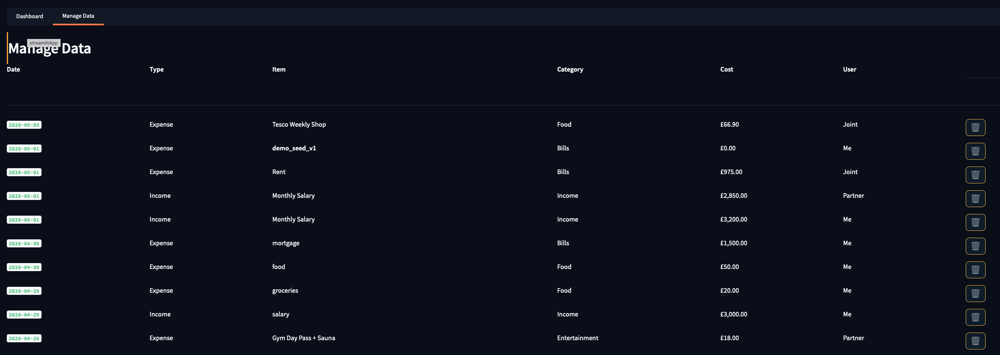
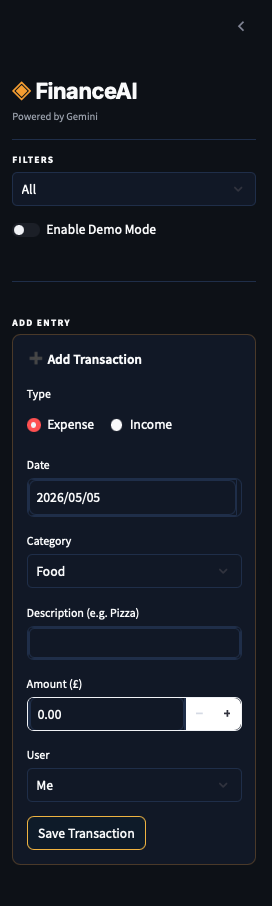

# FinanceAI

AI-powered personal finance tracker for natural language expense logging and spending analysis.


---

## What it does

1. **Natural language entry** — type `£15 Nando's last Tuesday`; Gemini 2.5 Flash parses the date, category, and amount into structured JSON, shows you a review card, then saves to Supabase on confirmation.
2. **Dashboard & metrics** — date range filter, income / expenses / net balance cards, and a savings rate split showing save vs spend at a glance.
3. **Spending trend charts** — visualise spending over time by category with interactive Plotly charts; filter by user (Me / Partner / Joint).
4. **Manage & export** — view all transactions in a full data table, delete by row number, and filter by user across the whole dataset.

---

## Tech stack

| Layer        | Technology                          |
|--------------|-------------------------------------|
| Frontend     | Streamlit                           |
| AI / Parsing | Google Gemini 2.5 Flash (genai SDK) |
| Database     | Supabase (Postgres)                 |
| Language     | Python 3.11+                        |

---

## Local setup

**1. Clone the repo**

```bash
git clone https://github.com/your-username/my-finance-app.git
cd my-finance-app
```

**2. Create a virtual environment and install dependencies**

```bash
python -m venv .venv
source .venv/bin/activate        # Windows: .venv\Scripts\activate
pip install -r requirements.txt
```

**3. Configure environment variables**

```bash
cp .env.example .env
```

Fill in the three credentials:

```env
GEMINI_API_KEY=your-gemini-api-key
SUPABASE_URL=https://your-project-id.supabase.co
SUPABASE_KEY=your-supabase-service-role-key
```

- **Gemini API key** — [Google AI Studio](https://aistudio.google.com/app/apikey)
- **Supabase URL and key** — Project Settings → API

> **Important** — use the service role key, not the anon key.
> The app has no login system, so Row Level Security would block all queries with the anon key.

**4. Set up the database**

Run the SQL schema in the Supabase SQL Editor:

```
supabase/migrations/001_create_transactions.sql
```

The file is idempotent — safe to re-run without side effects.

**5. Run the app**

```bash
streamlit run app.py
```

---

## How to use

### Add a transaction (AI)

1. **Type** a natural language description in the AI Assistant input — e.g. `£15 Nando's last Tuesday`
2. **Click** Process with AI — Gemini parses the entry into date, category, and amount
3. **Review** the parsed result on the confirmation card and click Confirm to save

### Add a transaction (manual)

1. **Open** the Add Transaction form in the sidebar
2. **Select** type (Income / Expense), date, category, description, amount, and user
3. **Click** Save

### View the dashboard

1. **Go to** the Dashboard tab
2. **Set** your date range using Start Date and End Date
3. **Filter** by user using the sidebar (All / Me / Partner / Joint)
4. **View** income, expense, and net balance metric cards
5. **Analyse** spending trends in the charts below

### Manage data

1. **Go to** the Manage Data tab
2. **View** all transactions in the table
3. **Delete** a transaction by entering its row number
4. **Export** to CSV using the download button

---

## Seeding demo data

To populate the app with realistic dummy data for a live demo, add a few transactions manually via the AI Assistant or manual form. Demo mode (toggle in sidebar) shows a fake confirmation without writing real data — useful for testing the AI flow without touching your database.

---

## Deploying to Streamlit Cloud

1. **Push** the repo to GitHub — confirm `.env` and `.streamlit/secrets.toml` are in `.gitignore`
2. **Go to** [share.streamlit.io](https://share.streamlit.io) and connect your repo
3. **Set** the main file path to `app.py`
4. **Add** your three credentials in Settings → Secrets using TOML format (see `.streamlit/secrets_template.toml` for the format)
5. **Deploy** — the app reads `st.secrets` automatically, no code changes needed

---

## Screenshots






---

## Project structure

```
my-finance-app/
├── app.py                          # Entry point shim — imports finance_app (Streamlit Cloud compatibility)
├── streamlit_app.py                # Alternate entry point for Streamlit Cloud
├── finance_app.py                  # Main app — Supabase backend, Gemini AI, all features
├── requirements.txt                # Pinned dependencies
├── .python-version                 # Python version pin (3.9; 3.11+ recommended)
│
├── supabase/
│   └── migrations/
│       └── 001_create_transactions.sql   # Initial schema — idempotent, safe to re-run
│
├── .streamlit/
│   └── secrets.toml                # 🔴 Local secrets only — never commit
│
├── .devcontainer/
│   └── devcontainer.json           # VS Code dev container config
│
├── _lessons/                       # Early Python learning exercises — kept for portfolio context
│   ├── jan18_basics.py
│   ├── jan19_decisions.py
│   └── ...
│
├── CLAUDE.md                       # AI assistant context — roadmap, architecture, session workflow
├── .gitignore
└── .python-version
```

---

## Author

Built by a developer who wanted a smarter way to log and understand personal spending. The goal was a tool that removes the friction of manual budgeting — speak naturally, let AI do the parsing, and get instant visibility into your finances. Built as a portfolio piece for AI engineering and FinTech roles.
